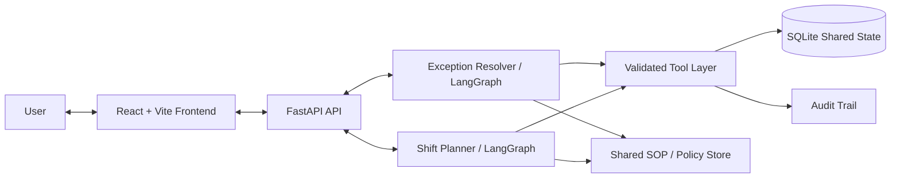

# Warehouse Agent System

A simulated warehouse operations prototype with two cooperating workflows:

- **Order Exception Resolver** — investigates seeded warehouse exceptions, retrieves shared SOP policy, and either performs a permitted simulated action, requests explicit approval, or escalates.
- **Shift Task Planner** — builds a deterministic multi-order/multi-picker shift plan using current inventory, picker availability/capacity, deadlines, progress, and modeled feasibility constraints.

Both workflows operate on the **same SQLite-backed warehouse state** and write to a shared audit trail. The LLM is used for reasoning/explanation, while database state changes and capacity/safety checks are performed through controlled backend tools.

## Architecture



## Key Features

- **Shared synthetic warehouse environment** with orders, order lines, inventory, shipments, pickers, exceptions, plans, and assignments.
- **7 seeded exception types**, including inventory shortfall, duplicate order, status conflict, invalid quantity, stale shipment, destination conflict, and missing inventory location.
- **Controlled actions**: the LLM does not directly modify the database; actions go through validated backend tools.
- **Safety boundaries** for autonomous, confirmation-gated, and escalation outcomes.
- **Explicit approval flow** for confirmation-required actions before the controlled action tool executes.
- **Shared policy/SOP retrieval** used by both resolver and planner workflows.
- **Deterministic planning/feasibility logic** for inventory, picker availability/capacity, deadlines, and progress rather than relying on LLM arithmetic.
- **Replanning** after a mid-shift change, with plan versioning and audit information.
- **Cross-agent shared state**: resolver changes are visible to the planner without maintaining a separate mutable copy.
- **Audit trail** for tool calls, decisions, approvals, state changes, escalations, and plan changes.
- **Scenario reset and seeded data** for reproducible demonstrations.

## Tech Stack

- **Backend:** Python 3.12+, FastAPI, SQLAlchemy, Pydantic, LangChain, LangGraph
- **Frontend:** Node.js 18+, React, Vite, Tailwind CSS
- **Database:** SQLite (file-backed for this prototype)
- **LLM providers:** Gemini or Groq, selected through environment variables

## Project Structure

```text
agentic-ai-warehouse-main/
├── backend/
│   ├── app/
│   │   ├── agents/       # Resolver and planner agent logic
│   │   ├── api/          # FastAPI routes
│   │   ├── core/         # Deterministic validation/rules/feasibility
│   │   ├── graph/        # LangGraph workflows
│   │   ├── models/       # SQLAlchemy models and DB setup
│   │   ├── schemas/      # Structured request/response schemas
│   │   ├── seed/         # Seed data, policies, and scenarios
│   │   ├── services/     # Application services
│   │   └── tools/        # Controlled warehouse/action tools
│   ├── tests/
│   ├── .env.example
│   └── requirements.txt
├── frontend/
├── docs/
└── docker-compose.yml
```

## Local Setup

### Prerequisites

- Python 3.12+
- Node.js 18+
- npm

### 1. Backend environment

From the repository root:

**Windows PowerShell:**

```powershell
cd backend
python -m venv venv
.\venv\Scripts\Activate.ps1
pip install -r requirements.txt
```

**macOS/Linux:**

```bash
cd backend
python3 -m venv venv
source venv/bin/activate
pip install -r requirements.txt
```

### 2. Configure environment variables

Copy the example environment file to `.env` inside `backend/` and add your own API key. Do not commit `.env`.

**Windows PowerShell:**

```powershell
Copy-Item .env.example .env
```

**macOS/Linux:**

```bash
cp .env.example .env
```

Example configuration:

```env
LLM_PROVIDER=gemini
GEMINI_API_KEY=your-gemini-api-key
GROQ_API_KEY=your-groq-api-key
MODEL_NAME=gemini-2.0-flash
DATABASE_URL=sqlite:///./warehouse.db
```

Only configure the provider you intend to use. Keep API keys local and never commit them.

### 3. Initialize/reset the synthetic warehouse database

The FastAPI application also creates the database and seeds it on startup when the database is empty. To explicitly reset/reseed the environment for a reproducible run, execute this from `backend/`:

```powershell
python -m app.seed.seed_database
```

The reset command recreates the synthetic warehouse state from the project seed data. No real WMS data is used.

### 4. Run the backend

From `backend/`:

```powershell
uvicorn app.main:app --reload --port 8000
```

The API will be available at:

```text
http://127.0.0.1:8000
```

FastAPI's interactive API documentation is available at `/docs`.

### 5. Run the frontend

Open a **second terminal** at the repository root:

```powershell
cd frontend
npm install
npm run dev
```

Open the local URL printed by Vite, normally:

```text
http://localhost:5173
```

## Running Tests

From `backend/` with the virtual environment activated:

```powershell
pytest -v
```

The tests cover deterministic rules/validation, controlled tools, seeded scenarios, cross-agent state, and final acceptance behavior.

## Demo / Evaluation Flows

Use the **Scenarios** page to reset the mock environment and run named cases. The project is designed to demonstrate:

1. **Autonomous resolution** — a low-risk, policy-supported correction/action.
2. **Escalation** — contradictory, missing, or unsupported evidence is held for human review.
3. **Confirmation-gated action** — the UI presents a proposed action, waits for explicit approval, then calls the controlled action tool and records the result.
4. **Ambiguous/contradictory case** — the resolver does not invent facts or silently overwrite conflicting records.
5. **Multi-order/multi-picker planning** — the planner considers deadline, inventory readiness, picker availability/capacity, and progress.
6. **Replanning** — a mid-shift picker availability change invalidates affected future work while preserving completed/valid progress where possible.
7. **Cross-agent integration** — a resolver update to shared warehouse state is visible to the planner as blocked/not-ready work with an exception reference.
8. **Audit inspection** — review tool calls, policy references, approvals, state changes, escalations, and plan changes in the Audit view.

## Seeded Exception Types

| ID | Exception | Expected safety behavior |
|---|---|---|
| EXC-001 | Inventory Shortfall | Hold/block affected work; do not invent inventory. |
| EXC-002 | Duplicate Order | Require explicit confirmation before the designated duplicate-order action. |
| EXC-003 | Shipment/Order Status Conflict | Preserve state and escalate conflicting authoritative records. |
| EXC-004 | Invalid Quantity | Reject/hold invalid data rather than applying an unsupported correction. |
| EXC-005 | Stale Shipment | Retrieve the shared SOP and apply the documented stale-shipment boundary. |
| EXC-006 | Conflicting Destination | Preserve state and escalate when destination records conflict. |
| EXC-007 | Missing Inventory Location | Surface the missing evidence and avoid unsupported fulfillment. |

## Shared Safety Model

The general execution pattern is:

```text
Agent request
    -> structured input/schema validation
    -> deterministic business-rule/policy check
    -> controlled tool execution
    -> audit event
    -> confirmed result
```

The LLM may propose reasoning or an action, but it cannot directly write database state. A tool failure is not treated as a successful state change.

## Documents

Project design and supporting documents are included under `docs/`, including:

- Phase 0 design
- Architecture
- Shared policy/SOP
- Scenario definitions
- Testing notes
- Reflection

## Production Boundary / Limitations

This is a **simulated take-home prototype**, not a production WMS. It uses synthetic data and local SQLite state. Production authentication, real WMS integrations, distributed/high-availability deployment, and enterprise observability are intentionally outside the project scope.

The current planner models warehouse location as structured data/heuristics rather than performing physical warehouse routing or real-world robotics control.
