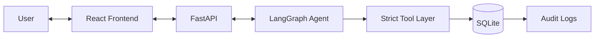

# Warehouse Agent System

An autonomous warehouse management system driven by Large Language Models (LLMs), featuring a strict deterministic tool layer for safety and an interactive frontend for monitoring.

## Overview

This project demonstrates a safe, agent-driven architecture where an LLM (Gemini or Groq) handles complex reasoning and planning, but state changes are strictly governed by deterministic Python backend rules.

## Architecture



## Features

*   **Autonomous Planning**: The agent can process orders, allocate inventory, and assign pickers based on SOPs.
*   **Exception Handling**: Detects and manages 7 distinct exception types (e.g., Inventory Shortfall, Duplicate Orders).
*   **Strict Safety Layer**: LLMs never touch the database directly; all actions pass through validated tools.
*   **Audit Trail**: Every automated decision is logged for transparency.
*   **Multi-Model Support**: Seamlessly switch between Gemini and Groq.

## Tech Stack

*   **Backend**: Python 3.12+, FastAPI, SQLAlchemy, Pydantic, LangChain, LangGraph
*   **Frontend**: Node.js, React, Vite, Tailwind CSS
*   **Database**: SQLite

## Setup Instructions

### Prerequisites

*   Python 3.12+
*   Node.js 18+

### Environment Setup

1.  Navigate to the `backend` directory.
2.  Copy `.env.example` to `.env`:
    ```bash
    cp .env.example .env
    ```
3.  Fill in your API keys in the `.env` file.

```env
# backend/.env
LLM_PROVIDER=gemini # or groq
GEMINI_API_KEY=your-gemini-api-key
GROQ_API_KEY=your-groq-api-key
MODEL_NAME=gemini-2.0-flash
DATABASE_URL=sqlite:///./warehouse.db
```

### Running the Backend

1.  Create and activate a virtual environment.
2.  Install dependencies:
    ```bash
    pip install -r requirements.txt
    ```
3.  Initialize the database (creates tables and seeds initial data):
    ```bash
    python init_db.py # Assuming this script exists
    ```
4.  Run the FastAPI server:
    ```bash
    uvicorn main:app --reload --port 8000
    ```

### Running the Frontend

1.  Navigate to the `frontend` directory.
2.  Install dependencies:
    ```bash
    npm install
    ```
3.  Start the development server:
    ```bash
    npm run dev
    ```

### Running Tests

From the `backend` directory:
```bash
pytest -v
```

## Demo Flows

1.  **Happy Path**: Process a standard order from PENDING to PLANNED.
2.  **Inventory Shortfall (EXC-001)**: Attempt to order more items than available.
3.  **Duplicate Detection (EXC-002)**: Submit the identical order twice rapidly.
4.  **Priority Routing**: Submit a High and Low priority order; observe picker assignment.
5.  **Policy Inquiry**: Ask the agent "What is the policy for stale shipments?"
6.  **Replanning**: Manually mark a picker UNAVAILABLE mid-task and ask the agent to replan.

## Known Limitations

*   In-memory SQLite database limits horizontal scalability.
*   Spatial planning (warehouse layout) is abstracted and not physically simulated.
