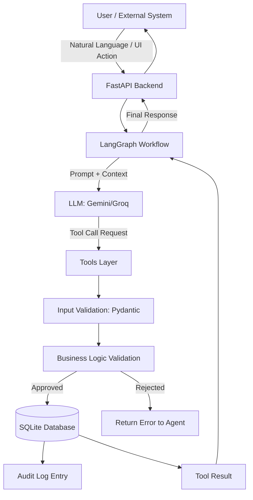

# Architecture Overview

The Warehouse Agent System is built on a modern, decoupled architecture leveraging LLMs for dynamic decision-making while relying on deterministic business rules for safety and state management.

## System Flow

## Key Components

1.  **Frontend**: React + Vite + Tailwind CSS. Provides a user interface for monitoring the warehouse state, viewing audit logs, and submitting natural language queries to the agent.
2.  **API Layer**: FastAPI + Pydantic. Exposes REST endpoints for the frontend and internal agent communication. Handles serialization and initial request validation.
3.  **Agent Workflows**: LangGraph. Manages the state machine of the agent, handling tool calling loops, memory, and transitions between reasoning and execution steps.
4.  **Tools Layer**: A set of strongly-typed Python functions exposed to the LLM. These are the *only* way the LLM can interact with the system.
5.  **Business Logic**: Deterministic rules embedded within the tools (or a separate feasibility engine). Ensures that no invalid state changes occur, regardless of what the LLM proposes.
6.  **Database**: SQLAlchemy ORM over a SQLite database. Handles persistence and transaction safety.
7.  **Policy Retrieval**: A simple RAG-like mechanism using keyword search and category filtering to provide relevant SOPs to the agent during execution.
8.  **Audit System**: Intercepts all state-changing operations and logs them to the `AuditLog` table.
9.  **LLM Provider Abstraction**: LangChain interfaces to allow seamless switching between Google Gemini and Groq models.

## The Key Principle

The most critical architectural principle is: **The LLM does not write to the database.**

User -> LangGraph workflow -> Tool call -> Input validation -> Business-rule validation -> Controlled state change -> Audit event -> Tool result -> Agent

This ensures safety, traceability, and deterministic behavior within an otherwise non-deterministic AI system.
